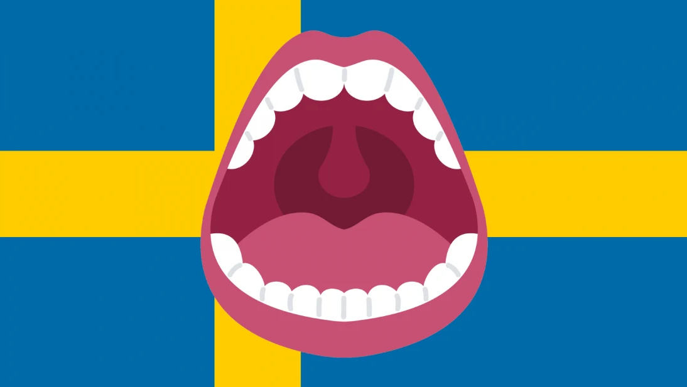

# How Swedish Students Let Off Steam—By Screaming in Public

*"At 22:00 precisely the windows open and the screaming begins," says an Uppsala University webpage covering "academic traditions."*

The line is referring to a local phenomenon that’s been taking place in a specific area of the Flogsta neighborhood of Uppsala, Sweden, since at least the '80s, and possibly as early as the '70s. The locals call it the Flogsta Scream, and it’s pretty simple: At the same time every night, a bunch of people lean out of their windows and scream.

The Scream isn’t restricted to only students, of course—or even to Flogsta, for that matter. The Lappkärrsberget residential area near Stockholm University has a neighborhood scream as well, known as the Lappkärr Cry, while Lund University students in the Delphi neighborhood of Lund, Sweden, participate in the Delphi Roar. (Other names include the Tuesday Scream—Lappkärrsberget screams on Tuesdays only—and Elvavrålet, or "the eleven roar," for the version in Lund, which happens at 11 p.m.)

Vuvuzelas (the plastic horns often found at South African soccer games) are incorporated in some versions as well. The screams generally last between one and two minutes, but they vary on a case-by-case basis. Some can last up to 10 minutes.

The lore behind this strange tradition varies as well. Some say that—at least in the case of Flogsta—the practice was started by students in the physics department at Uppsala who needed to let off stress and angst during exam season; others say it was begun as a memorial to a student who died by suicide.

It doesn’t necessarily happen every night, either. Arvid Cederholm, who lived in Flogsta in the early 2000s, tells Mental Floss, "I don't remember it being every evening, but rather if someone started it, others joined in. The angst wasn't a very pronounced part of it, I feel. It was more of a fun thing than an angsty thing."

*I always forget about the flogsta scream and I'll just be watching netflix or studying or w/e and just hear people screaming and freak out*

— indy (@indyea) February 15, 2017

Back in late 2014, the Flogsta scream received a small burst of attention on the internet thanks to a Reddit thread and a subsequent post on MTV’s website. Amid the swirl, the story somehow changed from "people collectively scream out of their windows at 10 p.m. in certain areas in Sweden" to "you can scream out of your window anywhere in Sweden and people will scream back." There was so much misinformation circulating surrounding the Flogsta scream that Snopes finally wrote a piece about it in order to set the facts straight. (They also noted that similar practices aren’t unknown on U.S. campuses.)

So just to be clear: This doesn’t happen everywhere across Sweden, only in Uppsala, Lund, or Stockholm, and only on specific university campuses. You can’t just show up in, say, downtown Gothenburg, start screaming, and expect folks to join you. You will just annoy the Swedes. Definitely don’t do this.

But if you ever happen to find yourself at the right Swedish university around 10 (or 11) at night and you’re feeling brave, it might be worth a shot. Maybe wait for someone else to start screaming first, though. Just in case.

